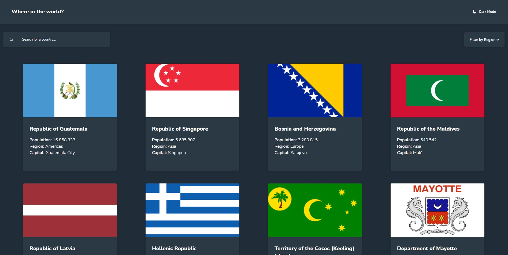
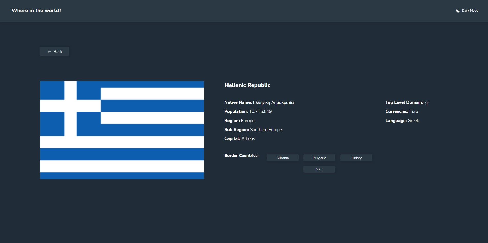
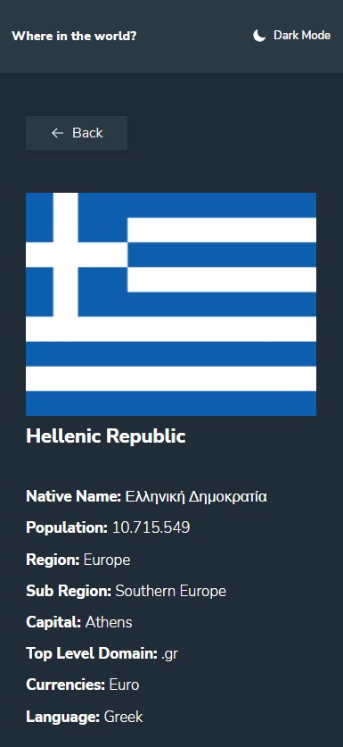
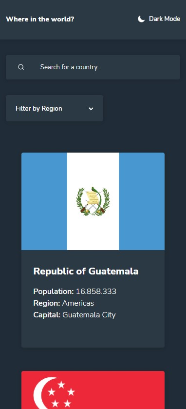

# Frontend Mentor - REST Countries API with color theme switcher solution

This is a solution to the [REST Countries API with color theme switcher challenge on Frontend Mentor](https://www.frontendmentor.io/challenges/rest-countries-api-with-color-theme-switcher-5cacc469fec04111f7b848ca). Frontend Mentor challenges help you improve your coding skills by building realistic projects.

## Table of contents

- [Overview](#overview)
  - [The challenge](#the-challenge)
  - [Screenshot](#screenshot)
  - [Links](#links)
- [My process](#my-process)
  - [Built with](#built-with)
  - [What I learned](#what-i-learned)
  - [Continued development](#continued-development)
- [Author](#author)

## Overview

### The challenge

Users should be able to:

- See all countries from the API on the homepage
- Search for a country using an `input` field
- Filter countries by region
- Click on a country to see more detailed information on a separate page
- Click through to the border countries on the detail page
- Toggle the color scheme between light and dark mode _(optional)_

### Screenshot






### Links

- Solution URL: [https://main--profound-granita-12a674.netlify.app/](https://main--profound-granita-12a674.netlify.app/)
- Live Site URL: [https://main--profound-granita-12a674.netlify.app/](https://main--profound-granita-12a674.netlify.app/)

## My process

### Built with

- Semantic HTML5 markup
- CSS custom properties
- Flexbox
- Mobile-first workflow
- [React](https://reactjs.org/) - JS library

### What I learned

Searching through region and then able to search through keywords inside the region.

```js
//All the data from API
const { data } = useContext(DataContext);
//Save the data here from @data to make filter and search operations on it without lose all the data from the API
const [localData, setLocalData] = useState();
//Search value
const [search, setSearch] = useState("");
//Filter value
const [filterRegion, setFilterRegion] = useState("");

//Set the all the data as default and able to be filtered
useEffect(() => {
  setLocalData(data);
}, [data]);

//When searching, the search is made on all the local data available, this available data change if we filter by region,
//when we set the region filter to "", we set again the local data to all the data from api
useEffect(() => {
  //To change the region, we need to reset the local data in case we have filtered before already with other region. Or we are
  //going to filter europe inside asia for example that will result in any country displayed
  setLocalData(data);
  if (filterRegion) {
    setLocalData((prev) =>
      prev?.filter((item) => item.region.toLowerCase().includes(filterRegion))
    );
  } else {
    setLocalData(data);
  }
}, [filterRegion]);
```

Dark mode implementation: setting css variables with same name, and change data-theme attribute to change this variables value.

```js
const [theme, setTheme] = useState(false);

function setLightMode() {
  document.querySelector("body").setAttribute("data-theme", "light");
  document.querySelector(".moon").setAttribute("fill", "none");
}

function setDarkMode() {
  document.querySelector("body").setAttribute("data-theme", "dark");
  document.querySelector(".moon").setAttribute("fill", "white");
}

function toggleTheme() {
  if (theme) {
    setDarkMode();
  } else {
    setLightMode();
  }
}

useEffect(() => {
  toggleTheme();
}, [theme]);
```

```css
:root {
  /*##Body##*/
  --px-homepage-items: 14px;
  --px-detail-page: 16px;

  /*##Fonts##*/
  --fw-low: 300;
  --fw-medium: 600;
  --fw-high: 800;

  /*##Colors##*/
  --background: hsl(207, 26%, 17%);
  /*Dark mode elements*/
  --elements: hsl(209, 23%, 22%);
  /*Light mode elements and dark mode text*/
  --text: hsl(0, 0%, 100%);
  /*Shadow*/
  --shadow: hsla(200, 15%, 8%, 0.251);
}

[data-theme="light"] {
  /*Light Mode Background*/
  --background: hsl(0, 0%, 98%);
  /*Light mode text*/
  --text: hsl(200, 15%, 8%);
  /*Light mode input adn shadows*/
  --shadow: hsla(0, 0%, 52%, 0.274);
  /*Light mode elements and dark mode text*/
  --elements: hsl(0, 0%, 100%);
}
```

### Continued development

A the searching method works on here, could not be scalable for further filters.

## Author

- Website - [David Gomez Gonzalez](https://www.david-gomez.xyz)
- Frontend Mentor - [dav9go](https://www.frontendmentor.io/profile/dav9go)
